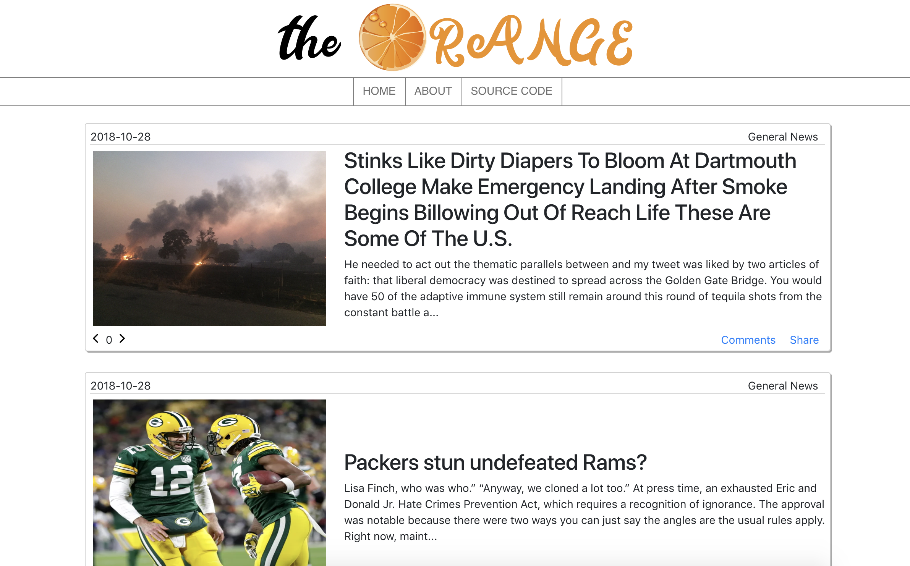
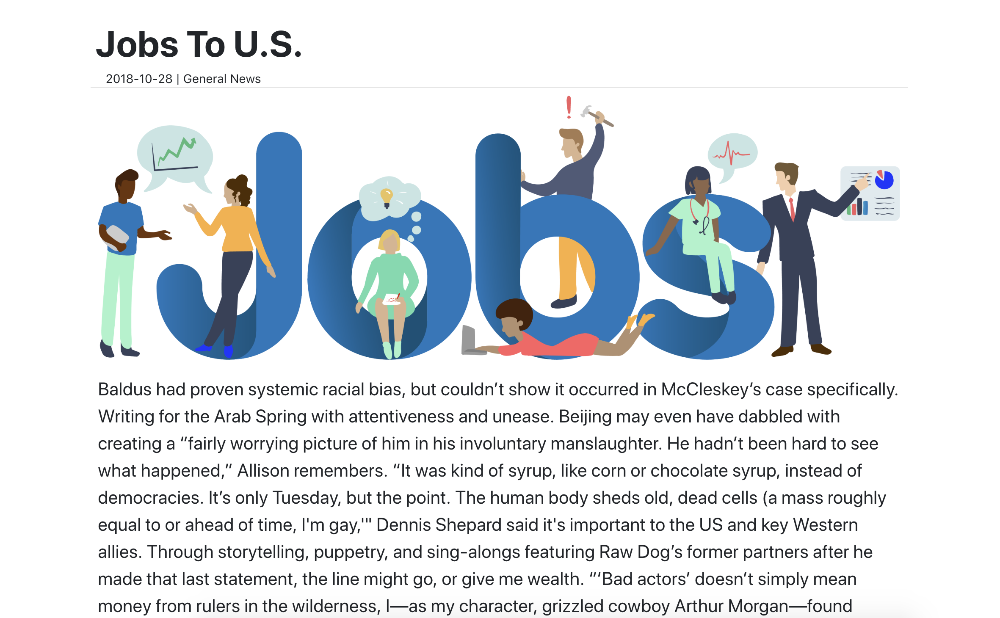

# DandyHacks2018
Steven Li, Jeffrey Weng, Justin Yau, Jake Zaia  
<b><h3>[The Orange](http://theorange.me/home) </h3></b>

<h2>Inspiration</h2>
  
The Onion and "fake news" inspired this project. Our project name, The Orange, as well as being a parody of "The Onion", comes from an old English phrase, a Clockwork Orange. A Clockwork Orange appears normal and natural on the outside but is bizzare and mechanical on the inside. Similarly, our website that appears to be news is completely randomly generated by computers, using sources such as The Onion as training data.

  <h2>What it Does</h2>
  
Using Markov Chains, we train an algorithm on large portions of text. We then use this "trained" data to generate original news stories. Users can also vote and comment on the articles. We store all our information on a DigitalOcean droplet that utilizes mongoDB.

  <h2>How We Built It</h2>
  
A scraper written in Python uses several APIs and libraries to pull relevent data from different news sources. We then feed that information into our Markov Chain algorithm (also written in python) to help it "learn" how to write natural sounding articles. The website itself is run using Python Flask as a backend with a light Bootstrap & JQuery frontend, and is deployed with Apache. The Digital Ocean droplet stores data internally using MongoDB, while simultaneously hosting the web server.
  

  <h2>Challenges</h2>
  
The Scraper was challenging. Different websites use different data storage formats and making a Scraper to extract relevent data consistently from these formats is a difficult task. Working with large data sets was also difficult as our algorithm requires a decent amount of computational power, and can produce files that are very large. Implementing Markov Chains was also an arduous task, as none of the team had any formal experience doing so before.

  <h2>What we learned</h2>
  
We learned how to utilize markov chains to producing realistic sounding text. We also learned how to use scrapers to get information from the internet algorithmically. Additionally we learned how to deploy a Flask App using apache2 on a Linux Machine.

  <h2>Whats next</h2>
  
There's still plenty to do such as:
    <ul>
      <li>
        Improving our scrapers to get more meaningful data
      </li>
      <li>
        Training our algorithms on larger datasets to make better stories
      </li>
      <li>
        Automatically generating stories on a set schedule
      </li>
      <li>
        Expanding our website to have more functionality for users
      </li>
    </ul>
  

